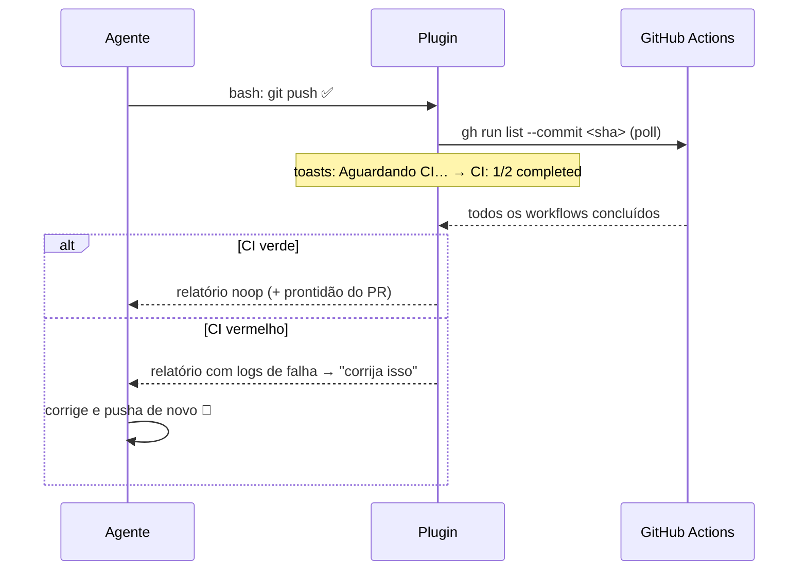

# opencode-ci-loop

> Você faz o push. O plugin encara o CI. O agente conserta sozinho.


[](https://bun.sh)
[](tsconfig.json)
[](https://opencode.ai)

Plugin de **CI validation loop** para o [opencode](https://opencode.ai) — o equivalente ao loop de validação do Claude Code desktop.

Depois que o agente roda `git push`, o plugin vigia o GitHub Actions e **injeta o resultado do CI (incluindo o tail dos logs de falha) de volta na sessão**. CI vermelho vira instrução de correção; o agente reage sem você pedir. Com toggle por sessão, toasts na TUI e dashboard visual ao vivo.

## Como funciona



1. O hook `tool.execute.after` detecta um `git push` bem-sucedido do agente
2. Um watch abortável faz poll do `gh run list --commit <sha>` até tudo concluir (ou estourar o timeout)
3. O relatório é injetado via `session.prompt` — **usando o modelo que a sessão estava usando**, não o default do agente
4. Se o branch tem PR aberto, o relatório inclui se ele está pronto para merge e os bloqueios exatos (draft, conflitos, review pendente…)

## Features

- **Detecção de push** — hook `tool.execute.after` captura `git push` do agente (ignora `--dry-run` e pushes rejeitados)
- **Watch do CI** — poll via `gh run list --commit <sha>` até todos os workflows concluírem
- **Injeção de contexto** — CI verde vira noop, CI vermelho vira instrução de correção com o tail dos logs de cada run que falhou
- **Prontidão do PR** — com PR aberto no branch, o relatório diz se dá pra mergear e lista os bloqueios exatos
- **Toggle por sessão** — tool `ci_watch` (`enable` / `disable` / `status`); peça ao agente "desliga o ci loop" a qualquer momento
- **Toasts na TUI** — `Aguardando CI…` → `CI: 1/2 completed` → `CI verde/com falhas` (dedup por transição de fase)
- **Dashboard ao vivo** — mini servidor HTTP+SSE em `http://127.0.0.1:4517` com painel por sessão
- **Multi-projeto** — instâncias do plugin em vários worktrees compartilham um único dashboard (singleton por porta)
- **Fork-aware** — resolve o repo do push via `@{push}` (o `gh` sozinho resolve pro remote `upstream` em forks e não acha os runs)

## Requisitos

- [GitHub CLI (`gh`)](https://cli.github.com/) autenticado
- Git

## Instalação

No `opencode.json`:

```json
{
  "plugin": ["opencode-ci-loop@git+https://github.com/rubimpassos/opencode-ci-loop.git"]
}
```

Ou com opções:

```json
{
  "plugin": [
    ["opencode-ci-loop@git+https://github.com/rubimpassos/opencode-ci-loop.git", {
      "autoWatch": true,
      "pollIntervalMs": 15000,
      "timeoutMs": 1800000,
      "failLogLines": 80,
      "dashboard": { "enabled": true, "host": "127.0.0.1", "port": 4517 }
    }]
  ]
}
```

| Opção | Default | Descrição |
|---|---|---|
| `autoWatch` | `true` | Estado inicial do loop em cada sessão |
| `pollIntervalMs` | `15000` | Intervalo de poll do `gh run list` |
| `initialDelayMs` | `5000` | Espera após o push antes do primeiro poll |
| `timeoutMs` | `1800000` (30min) | Tempo máximo vigiando um push |
| `failLogLines` | `80` | Linhas do tail de log por run com falha (10–500) |
| `dashboard.enabled` | `true` | Liga o servidor do painel visual |
| `dashboard.host` | `127.0.0.1` | Host do painel (mantenha em loopback) |
| `dashboard.port` | `4517` | Porta do painel |

## Uso

1. Peça ao agente para commitar e pushar — o loop dispara sozinho
2. Acompanhe pelos toasts ou pelo dashboard (`http://127.0.0.1:4517`)
3. CI falhou? O agente recebe o relatório com logs e corrige sem você pedir
4. "desliga o ci watch nesta sessão" → agente chama `ci_watch(action=disable)`

> [!TIP]
> O tool `ci_watch` também instrui o agente a **nunca** fazer poll manual do CI (`sleep`, `gh pr checks`, `gh run watch`) — o resultado sempre chega sozinho.

### Dashboard no OpenChamber

Abra `http://127.0.0.1:4517` no painel **browser/preview** do OpenChamber para ter o painel de CI ao vivo do lado do chat — status por workflow, spinner durante execução e logs de falha expansíveis.

A aba **PR** da área de git do OpenChamber também integra com o plugin: toggle "Monitor de CI" por sessão + badge de status ao vivo (o servidor do OpenChamber proxeia para o dashboard; porta configurável via `OPENCHAMBER_CI_LOOP_PORT`).

### HTTP API do dashboard

Todas as rotas exigem `Host` de loopback (barreira contra DNS rebinding).

| Rota | Método | Descrição |
|---|---|---|
| `/` | GET | Página do painel |
| `/state` | GET | Snapshot `SessionState[]` |
| `/events` | GET | SSE com snapshots ao vivo |
| `/sessions/:id` | GET | Estado de uma sessão (leitura pura; sessões nunca vistas herdam o default `autoWatch`) |
| `/sessions/:id/enabled` | POST | Liga/desliga o loop da sessão — body `{ "enabled": boolean }`, retorna o `SessionState` novo |

## Desenvolvimento

```bash
bun install
bun run check   # typecheck + biome + testes
```

## Arquitetura

```
src/plugin.ts    # wiring: hooks, tool ci_watch, toasts, injeção de prompt, singleton compartilhado
src/registry.ts  # estado por sessão + loop de watch (abortável)
src/gh.ts        # integração gh/git (exec injetável, fork-aware)
src/render.ts    # relatório markdown pro prompt + sumários + prontidão do PR
src/server.ts    # HTTP+SSE do dashboard
src/dashboard.ts # página do painel
```

Sem dependências de runtime além do `@opencode-ai/plugin`. Tudo tipado estrito, testado com `bun test`.

## Licença

MIT
