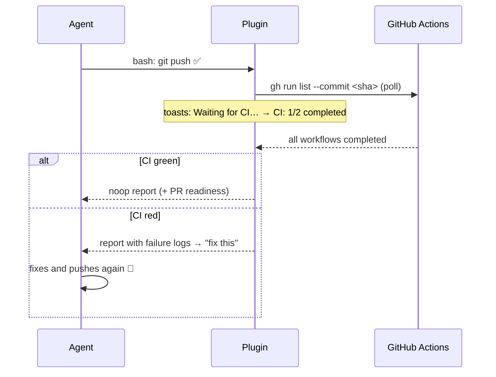

# opencode-ci-loop

> You push. The plugin stares down the CI. The agent fixes it on its own.

[](LICENSE)
[](https://bun.sh)
[](tsconfig.json)
[](https://opencode.ai)

**CI validation loop** plugin for [opencode](https://opencode.ai) — the equivalent of Claude Code desktop's validation loop.

After the agent runs `git push`, the plugin watches GitHub Actions and **injects the CI result (including failure log tails) back into the session**. Red CI becomes a fix instruction; the agent reacts without you asking. With a per-session toggle, TUI toasts, and a live visual dashboard.

## How it works



1. The `tool.execute.after` hook detects a successful `git push` from the agent
2. An abortable watch polls `gh run list --commit <sha>` until everything completes (or the timeout hits)
3. The report is injected via `session.prompt` — **using the model the session was using**, not the agent default
4. If the branch has an open PR, the report includes whether it's ready to merge and the exact blockers (draft, conflicts, pending review…)

## Features

- **Push detection** — `tool.execute.after` hook catches the agent's `git push` (ignores `--dry-run` and rejected pushes)
- **CI watch** — polls `gh run list --commit <sha>` until all workflows complete
- **Context injection** — green CI becomes a noop, red CI becomes a fix instruction with the log tail of every failed run
- **PR readiness** — with an open PR on the branch, the report says whether it can merge and lists the exact blockers
- **Per-session toggle** — `ci_watch` tool (`enable` / `disable` / `status`); tell the agent "turn off the ci loop" anytime
- **TUI toasts** — `Waiting for CI…` → `CI: 1/2 completed` → `CI green/failed` (deduped per phase transition)
- **Live dashboard** — mini HTTP+SSE server at `http://127.0.0.1:4517` with a per-session panel
- **Multi-project** — plugin instances across multiple worktrees share a single dashboard (per-port singleton)
- **Fork-aware** — resolves the push repo via `@{push}` (`gh` alone resolves to the `upstream` remote on forks and misses the runs)

## Requirements

- [GitHub CLI (`gh`)](https://cli.github.com/) authenticated
- Git

## Installation

In your `opencode.json`:

```json
{
  "plugin": ["opencode-ci-loop@git+https://github.com/rubimpassos/opencode-ci-loop.git"]
}
```

Or with options:

```json
{
  "plugin": [
    ["opencode-ci-loop@git+https://github.com/rubimpassos/opencode-ci-loop.git", {
      "autoWatch": true,
      "pollIntervalMs": 15000,
      "timeoutMs": 1800000,
      "failLogLines": 80,
      "dashboard": { "enabled": true, "host": "127.0.0.1", "port": 4517 }
    }]
  ]
}
```

| Option | Default | Description |
|---|---|---|
| `autoWatch` | `true` | Initial loop state for each session |
| `pollIntervalMs` | `15000` | `gh run list` polling interval |
| `initialDelayMs` | `5000` | Wait after the push before the first poll |
| `timeoutMs` | `1800000` (30min) | Maximum time watching a push |
| `failLogLines` | `80` | Log tail lines per failed run (10–500) |
| `dashboard.enabled` | `true` | Enables the visual panel server |
| `dashboard.host` | `127.0.0.1` | Panel host (keep it on loopback) |
| `dashboard.port` | `4517` | Panel port |

## Usage

1. Ask the agent to commit and push — the loop kicks in on its own
2. Follow along via toasts or the dashboard (`http://127.0.0.1:4517`)
3. CI failed? The agent receives the report with logs and fixes it without you asking
4. "turn off the ci watch for this session" → the agent calls `ci_watch(action=disable)`

> [!TIP]
> The `ci_watch` tool also instructs the agent to **never** poll CI manually (`sleep`, `gh pr checks`, `gh run watch`) — the result always arrives on its own.

### Dashboard in OpenChamber

Open `http://127.0.0.1:4517` in OpenChamber's **browser/preview** panel to get the live CI panel next to the chat — per-workflow status, spinner while running, and expandable failure logs.

The **PR** tab in OpenChamber's git area also integrates with the plugin: a per-session "CI Monitor" toggle + live status badge (the OpenChamber server proxies to the dashboard; port configurable via `OPENCHAMBER_CI_LOOP_PORT`).

### Dashboard HTTP API

All routes require a loopback `Host` (barrier against DNS rebinding).

| Route | Method | Description |
|---|---|---|
| `/` | GET | Panel page |
| `/state` | GET | `SessionState[]` snapshot |
| `/events` | GET | SSE with live snapshots |
| `/sessions/:id` | GET | State of one session (pure read; never-seen sessions inherit the `autoWatch` default) |
| `/sessions/:id/enabled` | POST | Toggles the session's loop — body `{ "enabled": boolean }`, returns the new `SessionState` |

## Development

```bash
bun install
bun run check   # typecheck + biome + tests
```

## Architecture

```
src/plugin.ts    # wiring: hooks, ci_watch tool, toasts, prompt injection, shared singleton
src/registry.ts  # per-session state + watch loop (abortable)
src/gh.ts        # gh/git integration (injectable exec, fork-aware)
src/render.ts    # markdown report for the prompt + summaries + PR readiness
src/server.ts    # dashboard HTTP+SSE
src/dashboard.ts # panel page
```

No runtime dependencies beyond `@opencode-ai/plugin`. Strictly typed, tested with `bun test`.

## License

[MIT](LICENSE)
